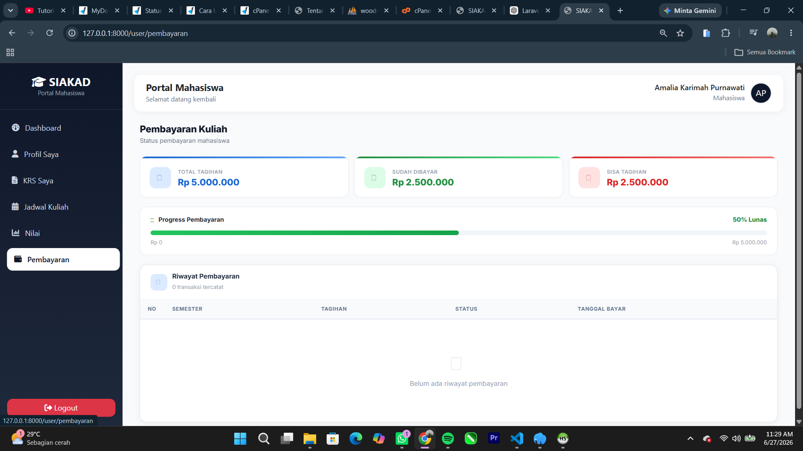

# SIAKAD — Sistem Informasi Akademik

> Sistem Informasi Akademik berbasis web untuk manajemen data kampus secara digital dan terpusat.

**Nama &nbsp;&nbsp;:** Pajri Muhamad  
**NPM &nbsp;&nbsp;&nbsp;:** 5520124025  
**Link &nbsp;&nbsp;&nbsp;:** https://pajri.ifalgorithm24.web.id/

---

## Screenshots

### Halaman Login


---

### Admin — Dashboard


---

### Admin — Manajemen Mahasiswa


---

### Admin — Manajemen Dosen


---

### Admin — Manajemen Mata Kuliah


---

### Admin — Manajemen Jadwal


---

### Admin — Manajemen KRS


---

### Admin — Manajemen Nilai


---

### Admin — Manajemen User


---

### Admin — Profil


---

### Admin — Edit Profil


---

### Mahasiswa — Dashboard


---

### Mahasiswa — Profil


---

### Mahasiswa — KRS


---

### Mahasiswa — Nilai


---

### Mahasiswa — Jadwal


---

### Mahasiswa — Pembayaran


---

### Mahasiswa — Cetak


---

## Tentang Sistem

SIAKAD adalah aplikasi web manajemen akademik kampus yang dibangun menggunakan **Laravel 12**, **PHP 8.3**, dan **MySQL**. Sistem ini mengelola seluruh proses akademik secara digital dan terpusat — mulai dari data mahasiswa, dosen, mata kuliah, jadwal, KRS, nilai, hingga pembayaran SPP.

Akses sistem dibagi menjadi dua role utama menggunakan **Spatie Laravel Permission**:

- **Admin** — akses penuh ke seluruh modul pengelolaan data
- **Mahasiswa** — akses terbatas hanya pada data akademik milik sendiri

---

## Stack Teknologi

| Komponen | Teknologi |
| --- | --- |
| Backend | Laravel 12 |
| Bahasa | PHP 8.3 |
| Database | MySQL |
| Role & Permission | Spatie Laravel Permission |
| Export / Import | Maatwebsite Laravel Excel |
| Frontend | Bootstrap 5 + Custom CSS |
| Ikon | Font Awesome |
| Avatar | UI Avatars API |
| Auth | Laravel Session Auth |

---

## Fitur Umum

- Login dan logout dengan email + password
- Role-based Access Control (Admin / Mahasiswa)
- Tampilan responsif desktop dan mobile
- Flash message sukses / error di setiap aksi
- Pagination Bootstrap 5 di semua tabel
- Export Excel dengan header berwarna di semua modul utama
- Import Excel massal dengan validasi dan skip baris tidak valid
- Proteksi duplikat data

---

## Halaman Admin

### 1. Dashboard

Halaman utama setelah login admin. Menampilkan ringkasan statistik total mahasiswa, dosen, mata kuliah aktif, dan KRS terdaftar. Topbar menampilkan nama dan foto avatar yang bisa diklik untuk masuk ke halaman profil.

---

### 2. Manajemen User

Route: `/users`

- Tabel user dengan avatar, nama, email, role badge, dan tanggal bergabung
- Filter chip per role: Semua / Admin / Dosen / Mahasiswa
- Pencarian berdasarkan nama atau email
- Tambah user: form nama, email, role, password + konfirmasi, toggle show/hide password
- Edit: perbarui data + opsional ganti password + sinkronisasi role
- Detail: tampilan lengkap info akun
- Hapus: admin tidak bisa menghapus akunnya sendiri
- Export Excel mengikuti filter role yang aktif
- Import Excel — format kolom: `name | email | password | role`

---

### 3. Manajemen Dosen

Route: `/dosen`

- Tabel dosen dengan NIDN, nama, email, dan no. HP
- Pencarian berdasarkan nama atau NIDN
- Tambah dosen: form NIDN, nama, email, no. HP, alamat
- Akun login dibuat otomatis — email sebagai username, NIDN sebagai password default
- Edit, detail, dan hapus data dosen

---

### 4. Manajemen Mahasiswa

Route: `/mahasiswa`

- Tabel dengan NIM, nama, jenis kelamin, angkatan, dan semester
- Filter berdasarkan angkatan atau semester aktif
- Pencarian berdasarkan nama atau NIM
- Tambah mahasiswa sekaligus membuat akun login otomatis
- Edit, detail, dan hapus data mahasiswa
- Export dan import Excel

---

### 5. Manajemen Mata Kuliah

Route: `/matakuliah`

- Tabel dengan kode MK, nama MK, SKS, dan semester
- Form tambah / edit dua kolom: kode MK, nama MK, SKS (1-6), semester (1-8)
- Hapus mata kuliah

---

### 6. Manajemen Jadwal

Route: `/jadwal`

- Tabel dengan mata kuliah, dosen, hari, jam mulai-selesai, kelas, dan ruangan
- Filter berdasarkan hari atau dosen pengampu
- Tambah, edit, detail, dan hapus jadwal
- Relasi langsung ke data dosen dan mata kuliah

---

### 7. Manajemen KRS

Route: `/krs`

- Tabel dengan avatar mahasiswa, nama, NIM, dosen, mata kuliah, jadwal, tahun akademik, dan badge semester
- Filter Ganjil / Genap menggantikan filter semester 1-8
- Pencarian berdasarkan nama mahasiswa, NIM, nama atau kode mata kuliah, nama dosen
- Tambah KRS: pilih mahasiswa, jadwal, semester (optgroup Ganjil/Genap), tahun akademik — dilengkapi proteksi duplikat
- Edit: data lama terisi otomatis di semua field
- Detail: 3 info card (mahasiswa, mata kuliah, jadwal) + tabel detail + tombol hapus
- Export mengikuti filter Ganjil/Genap yang aktif
- Import Excel — format kolom: `nim | kode_mk | semester | tahun_akademik`

---

### 8. Manajemen Nilai

Route: `/nilai`

- Tabel dengan mahasiswa, mata kuliah, semester, grade badge berwarna, dan nilai angka
- Filter grade per kategori:

| Grade | Keterangan | Rentang Nilai |
| --- | --- | --- |
| A | Sangat Baik | >= 85 |
| B | Baik | 70 - 84 |
| C | Cukup | 55 - 69 |
| D | Kurang | 40 - 54 |
| E | Tidak Lulus | < 40 |

- Pencarian berdasarkan nama mahasiswa, NIM, nama atau kode MK, keterangan
- Tambah nilai: grade A-E, nilai angka terisi otomatis saat pilih grade (bisa diubah manual)
- Edit: semua field terisi otomatis dengan data lama
- Detail: 3 info card + tabel detail + tombol hapus
- Export mengikuti filter grade yang aktif
- Import Excel — format kolom: `nim | kode_mk | semester | nilai | angka | keterangan`

---

### 9. Manajemen Pembayaran

Route: `/pembayaran`

- Tabel dengan nama mahasiswa, semester, nominal tagihan, status, dan tanggal bayar
- Filter berdasarkan status: Lunas / Belum Lunas
- Tambah, edit, detail, dan hapus data pembayaran
- Update status pembayaran langsung dari tabel

---

### 10. Profil Admin

Route: `/profil`

- Menampilkan avatar otomatis, nama, email, role badge, dan tanggal bergabung
- Edit profil: ubah nama dan email, avatar preview berubah langsung saat nama diketik
- Ganti password opsional — kosong berarti tidak berubah
- Diakses via klik foto avatar di topbar navigasi

---

## Halaman Mahasiswa

Mahasiswa hanya dapat mengakses dan melihat data milik sendiri.

### 1. Dashboard
Ringkasan akademik pribadi: total SKS, mata kuliah aktif, IPK, dan status pembayaran SPP.

### 2. KRS Saya
Daftar KRS semester aktif dengan info mata kuliah, dosen, jadwal, dan ruangan.

### 3. Nilai Saya
Rekapitulasi nilai per semester dengan grade A-E, nilai angka, dan keterangan.

### 4. Jadwal Saya
Jadwal perkuliahan yang sedang diambil pada semester aktif.

### 5. Pembayaran Saya
Riwayat tagihan SPP per semester beserta status dan tanggal pelunasan.

### 6. Cetak
Cetak atau unduh data akademik (KRS / transkrip nilai) dalam format yang siap cetak.

### 7. Profil Mahasiswa
Lihat dan perbarui data pribadi: nama, email, no. HP, alamat, dan ganti password.

---

## Cara Instalasi

```bash
# 1. Clone repository
git clone <url-repository>
cd siakad

# 2. Install dependency
composer install
npm install && npm run build

# 3. Konfigurasi environment
cp .env.example .env
php artisan key:generate

# 4. Atur koneksi database di file .env
DB_DATABASE=siakad
DB_USERNAME=root
DB_PASSWORD=

# 5. Migrasi dan seeder
php artisan migrate --seed

# 6. Jalankan server
php artisan serve
```

---

## Akun Default

| Role | Email | Password |
| --- | --- | --- |
| Admin | admin@siakad.ac.id | password |
| Mahasiswa | mahasiswa@siakad.ac.id | password |

---

> Dikembangkan sebagai tugas akhir mata kuliah Rekayasa Perangkat Lunak menggunakan Laravel 12 dengan pendekatan MVC.